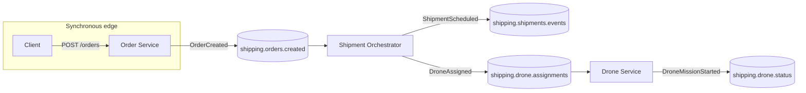

# Shipping on the Air — Technical Report (Final Assignment)

## 1. Event-driven architecture

### 1.1 Case context

In *Shipping on the Air*, the business process naturally decomposes into stages that are **asynchronous** and **long-running**: an order is accepted, a shipment is planned, a drone is assigned, the mission executes, and status updates propagate to customers and operations. A central **shipment orchestration** concern coordinates these transitions and is a strong fit for **domain events** and **eventual consistency** via a log.

### 1.2 Service chosen for re-engineering

The **Shipment Orchestrator** microservice is the best candidate for an event-driven style:

- It reacts to **OrderCreated** facts rather than blocking the order API on routing, weather checks, or fleet availability.
- It publishes **ShipmentScheduled** and **DroneAssigned** events that downstream systems (drone adapter, tracking UI, billing) can subscribe to without tight coupling.
- It scales by **horizontal consumer groups** and tolerates bursts of orders better than a synchronous chain of REST calls.

The **Order Service** remains a classic REST boundary for external clients: it validates input, assigns an `order_id`, and emits a single durable event. The **Drone Service** is minimally adapted: it **consumes** assignments from Kafka and **emits** mission status events, replacing or complementing a pull-based integration.

### 1.3 Apache Kafka middleware

Kafka provides an append-only **event log** per topic with ordering per key (here, `order_id` / `shipment_id` / `drone_id`). The orchestrator participates as:

- **Consumer** on `shipping.orders.created` (consumer group `shipment-orchestrator`).
- **Producer** on `shipping.shipments.events` and `shipping.drone.assignments`.

This matches the textbook pattern of **event notification** + **event-carried state transfer** (payloads carry enough fields for consumers to act without an extra synchronous read).

### 1.4 Event diagram (conceptual)



## 2. Service levels: SLOs and SLIs

### 2.1 Definitions

An **SLI** (Service Level Indicator) is a measured signal of service quality. An **SLO** (Service Level Objective) is a target on that signal over a time window (e.g. 30 days), often expressed with an error budget.

### 2.2 SLO 1 — Orchestration latency

- **User story:** After an order is accepted, operations and the customer expect a shipment plan quickly.
- **SLI:** Time from **`OrderCreated.occurred_at_ms`** to **successful publication** of `ShipmentScheduled` (end-to-end in the orchestrator), in seconds.  
  **Implementation:** Prometheus histogram `shipment_orchestrator_order_to_shipment_scheduled_seconds` (see orchestrator `/metrics`).
- **SLO:** **99% of orders** complete this transition in **under 2 seconds** per rolling **30-day** window (excluding maintenance windows if your policy defines them).

**Example PromQL (for SLI dashboards; pair with alerting rules for error budget burn):**

```promql
histogram_quantile(
  0.99,
  sum(rate(shipment_orchestrator_order_to_shipment_scheduled_seconds_bucket[5m])) by (le)
)
```

### 2.3 SLO 2 — Order API availability

- **User story:** Customers must be able to place orders during peak load.
- **SLI:** Ratio of **successful** HTTP responses to **all** responses for `POST /orders` on the order service. Count **2xx** as success; **5xx** as failure; **4xx** can be excluded or counted per product policy (here: exclude client errors from the availability denominator for a cleaner “service health” view).
- **Implementation:** Counters `order_api_http_requests_total{route="/orders",method="POST",status_code="..."}` and latency histogram `order_api_request_duration_seconds`.
- **SLO:** **99.5% availability** over **30 days** for `POST /orders` (success = 2xx).

**Example PromQL (sketch):**

```promql
sum(rate(order_api_http_requests_total{route="/orders",method="POST",status_code=~"2.."}[30d]))
/
sum(rate(order_api_http_requests_total{route="/orders",method="POST"}[30d]))
```

### 2.4 Gap to production

For a real deployment you would add **RED/USE** metrics, **structured logs** with trace IDs, **OpenTelemetry** traces from order → Kafka → orchestrator, and **SLO burn alerts** (multi-window, multi-burn-rate) on top of these SLIs.

## 3. Kubernetes deployment

Manifests under `k8s/` define:

- Namespace `shipping-on-the-air`
- **ConfigMap** `shipping-kafka` with `bootstrap.servers` (adjust to your cluster’s Kafka Service DNS)
- **Deployments + ClusterIP Services** for each microservice and for **Prometheus**
- **Readiness probes** on `/health`

Kafka itself is **not** pinned to a single vendor YAML here: course clusters differ. Common options are **Strimzi**, the **Bitnami Kafka** Helm chart, or a managed offering. Once a `Service` named `kafka` exists on port `9092` in-namespace (or you update DNS in the ConfigMap), the applications connect with no code changes—only configuration.

Building and loading container images into a local cluster (Kind, Minikube, k3d) is described in `README.md`.

## 4. Agent-based architecture (optional)

### 4.1 Model

Autonomous drone control can be modeled with **Belief–Desire–Intention (BDI)**:

- **Beliefs:** Estimated state from sensors (battery, wind, obstacle ranging, distance to drop).
- **Desires:** Mission goals (“deliver package”, “preserve safe energy reserve”).
- **Intentions:** Committed course of action (deliver, hold, return-to-base).

This separates **reactive** safety (obstacle, wind) from **deliberative** mission selection and matches the *Shipping on the Air* narrative of operating under partial observability and changing conditions.

### 4.2 Prototype

`agents/drone_bdi/main.py` implements a **tight sense–deliberate–act loop** with stubbed sensors and prints intentions. It is intentionally small: the goal is to show how an **agent architecture** could wrap the same mission lifecycle that emits Kafka **DroneMissionStarted** and future telemetry events in the main system.

## 5. Repository map

| Path | Purpose |
|------|---------|
| `docker-compose.yml` | Local Kafka + services + Prometheus |
| `services/order_service/` | REST + Kafka producer |
| `services/shipment_orchestrator/` | Event-driven core |
| `services/drone_service/` | Kafka consumer/producer drone adapter |
| `infra/prometheus.yml` | Compose Prometheus scrape config |
| `k8s/` | Kubernetes manifests |
| `agents/drone_bdi/` | BDI drone prototype |

## 6. Conclusion

The Shipment Orchestrator is re-engineered around **Kafka** as the middleware backbone while preserving a **thin synchronous** API at the edge. Two **SLIs**—orchestration latency and order endpoint availability—are instrumented via **Prometheus**, and **Kubernetes** manifests encode a repeatable deployment shaped for a real cluster-supplied Kafka. The optional **BDI** sketch grounds autonomous flight control in established agent metaphors aligned with the case study.
